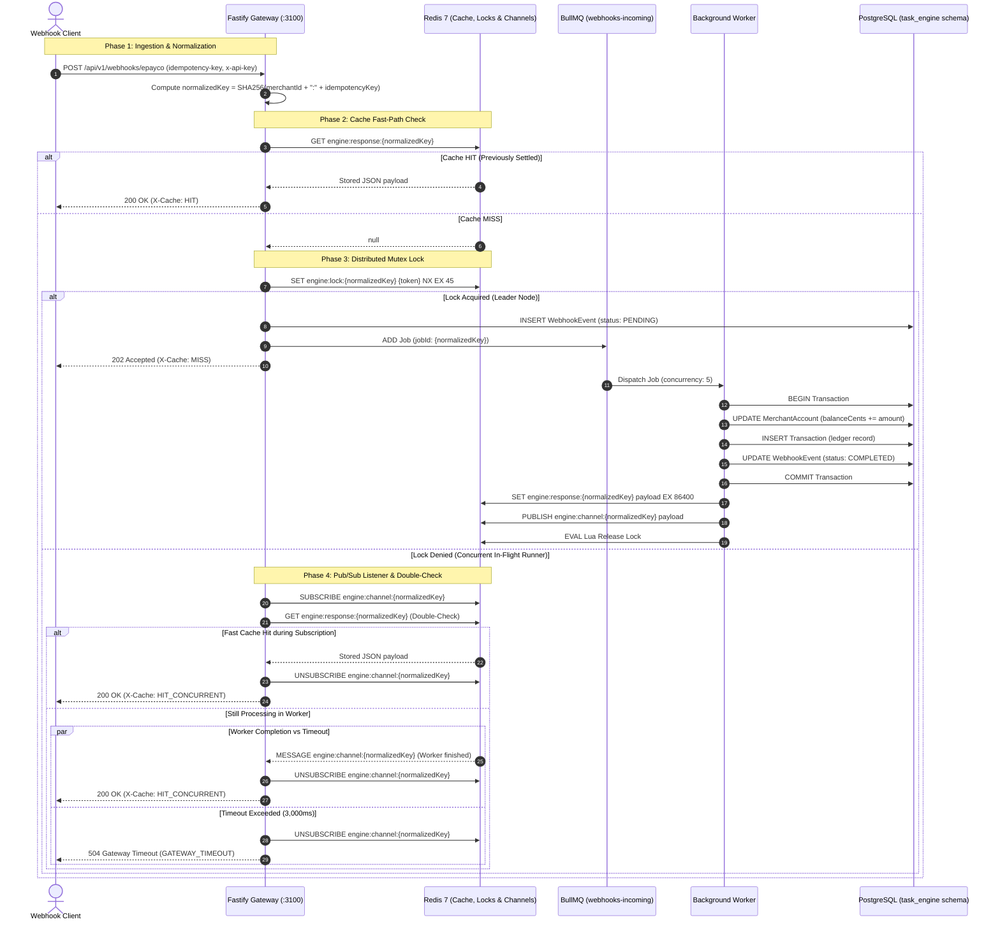

# 03. Distributed Idempotency Protocol (Stripe-Grade)

## Overview & Mathematical Invariant

In distributed financial transaction networks, delivery guarantees are at-least-once. The idempotency protocol ensures that for any set of identical requests:

$$\forall R_1, R_2, \dots, R_n \quad \text{where} \quad \text{Key}(R_i) = \text{Key}(R_j), \quad \text{StateUpdates}(R_1, \dots, R_n) \equiv 1$$

Logical processing and financial settlement occur exactly once.

---

## Visual Sequence Diagram: Distributed Execution Protocol



---

## Double-Checked Locking Protocol

When hundreds of concurrent requests arrive within sub-millisecond windows:

1. **Runner B** fails to acquire the distributed mutex (`SET NX` returns null).
2. **Runner B** immediately subscribes to `engine:channel:{normalizedKey}`.
3. **Double-Check Invariant:** Runner B queries `engine:response:{normalizedKey}` immediately _after_ subscribing. This eliminates the race condition where the leader worker finishes and publishes the completion payload during the socket registration window of Runner B.
4. If cached, Runner B unsubscribes immediately and returns `200 OK` without waiting for the timeout timer.

---

## Standardized Error Codes Matrix

| HTTP Status           | Machine-Readable Code | Condition                                       | Recovery Action                                     |
| :-------------------- | :-------------------- | :---------------------------------------------- | :-------------------------------------------------- |
| `400 Bad Request`     | `INVALID_HEADERS`     | Missing `idempotency-key` or `x-api-key` header | Verify merchant API client headers                  |
| `400 Bad Request`     | `INVALID_BODY`        | Schema validation error on payload fields       | Correct payload JSON typing                         |
| `401 Unauthorized`    | `UNAUTHORIZED`        | API key not recognized in `MerchantAccount`     | Validate active merchant credentials                |
| `504 Gateway Timeout` | `GATEWAY_TIMEOUT`     | Worker took > 3,000ms; listener timed out       | No duplicate job scheduled; caller can retry safely |

---

## Operational Recovery Runbook

### Scenario 1: Worker Crash While Holding Distributed Lock

- **Symptom:** Subsequent requests for the same idempotency key receive `GATEWAY_TIMEOUT`.
- **Automatic Mitigation:** All distributed locks are created with `EX 45` (45-second Redis TTL). The lock will expire automatically without human intervention.
- **Manual Intervention:** If immediate clearance is required:
  ```bash
  # Delete specific in-flight lock key in Redis
  redis-cli DEL engine:lock:<normalizedKey>
  ```

### Scenario 2: Redis Service Restart or Network Partition

- **Symptom:** API logs `Redis connection error` and rejects lock acquisition.
- **Recovery:** Fastify routes fall back to safe error responses; BullMQ workers pause processing until Redis reconnection.
- **Health Verification:**
  ```bash
  curl -s http://localhost:3100/health | jq .
  ```

---

## Edge Case Test Suite (`apps/api/tests/unit/idempotency.test.ts`)

Targeted automated unit tests verify critical edge conditions:

1. **Deterministic Normalization:** SHA256 deterministic hashing across merchant ID and idempotency key pairs.
2. **Cache Integrity & Graceful Deserialization:** Key existence checks, roundtrip payload verification, and corrupted JSON tolerance (`null` fallback).
3. **Distributed Lock TTL & Mutex Isolation:** Strict `SET NX EX` mutexing, key TTL verification, and Lua script atomicity ensuring only token owners release locks.
4. **Race Condition Timeouts & Subscriber Cleanup:** Sub-second timeout resolution, listener unregistration (`off('message')`), fast-path double-check cache return, and zero subscriber memory leaks.
