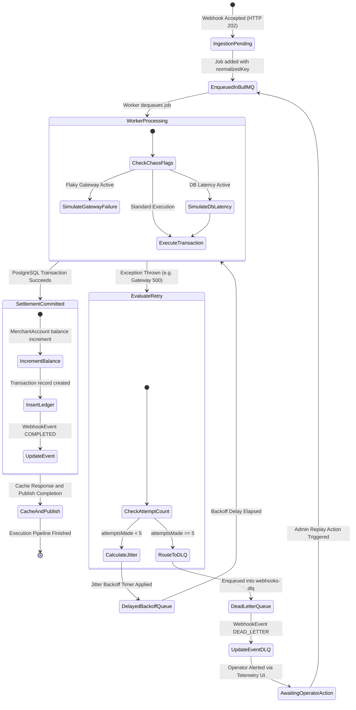

# 04. Queue Resilience & Jitter Implementation

## Overview

High-throughput transactional systems face transient downstream outages (e.g., banking partner 500 errors, network timeouts, database lock contention). Without jittered backoff, retrying workers synchronize and create catastrophic thundering herd events.

---

## Visual State Machine: BullMQ Worker Lifecycle & Backoff



---

## Full Jitter Exponential Backoff Specification

BullMQ is configured with a custom exponential backoff strategy utilizing **Full Jitter** to ensure retries are uniformly distributed across the temporal delay interval:

$$T_{\text{sleep}} = \text{random}\left(0, \; \text{delay}_{\text{base}} \times 2^{\text{attemptsMade}}\right)$$

### Configuration Parameters

- **Base Delay:** $1,000\,\text{ms}$
- **Multiplier:** $2$
- **Max Delay Cap:** $30,000\,\text{ms}$
- **Maximum Retry Attempts:** $5$

### Exponential Delay Window Distribution

| Attempt Number | Maximum Upper Bound ($2^n \times 1000\,\text{ms}$) |     Effective Uniform Random Range     |
| :------------: | :------------------------------------------------: | :------------------------------------: |
|     **1**      |                 $2,000\,\text{ms}$                 | $[0\,\text{ms}, \; 2,000\,\text{ms}]$  |
|     **2**      |                 $4,000\,\text{ms}$                 | $[0\,\text{ms}, \; 4,000\,\text{ms}]$  |
|     **3**      |                 $8,000\,\text{ms}$                 | $[0\,\text{ms}, \; 8,000\,\text{ms}]$  |
|     **4**      |                $16,000\,\text{ms}$                 | $[0\,\text{ms}, \; 16,000\,\text{ms}]$ |
|     **5**      |            $30,000\,\text{ms}$ (Capped)            | $[0\,\text{ms}, \; 30,000\,\text{ms}]$ |

---

## Dead Letter Queue (DLQ) Routing

When a job exhausts all 5 attempts:

1. The primary worker automatically catches the final failure event.
2. The `WebhookEvent` row in PostgreSQL is updated with:
   - `status = DEAD_LETTER`
   - `lastError = err.message + stack`
   - `attempts = 5`
3. The job payload is pushed to the dedicated `webhooks-dlq` queue with original diagnostic headers.
4. The DLQ counter on the Telemetry Dashboard updates in real-time via Server-Sent Events.

---

## Operational Recovery Runbook

### Inspecting Dead-Lettered Jobs

1. Navigate to Bull-Board UI at `http://localhost:3100/admin/queues`.
2. Select the `webhooks-dlq` tab to inspect payloads, error stack traces, and attempt histories.
3. Alternatively, query the paginated audit endpoint:
   ```bash
   curl -s "http://localhost:3100/api/v1/events?status=DEAD_LETTER" | jq .
   ```

### Replaying Dead-Lettered Jobs (Automated DLQ Replay)

1. In the Web Telemetry Dashboard, click **Replay All** in the Dead Letter Queue card.
2. Confirm the action in the accessible confirmation modal.
3. Or trigger programmatically via CLI / curl:
   ```bash
   curl -X POST http://localhost:3100/api/v1/admin/dlq/replay
   ```
4. All dead-lettered jobs are moved atomically back into `webhooks-incoming` with attempt counters reset.
