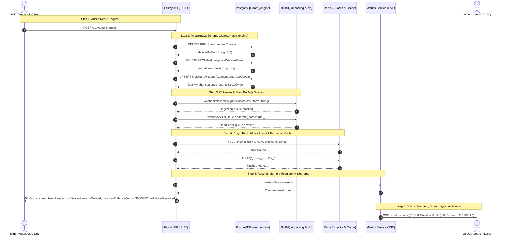
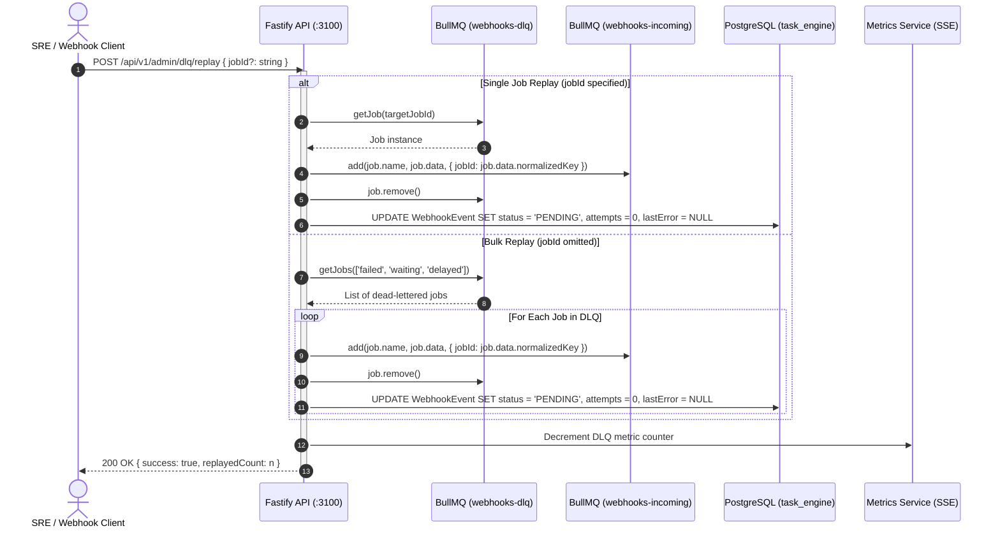

# 08. Operational Administration & Reset Runbook

## 1. Prerequisites & Port/Protocol Matrix

This specification defines the SRE administrative and maintenance endpoints used for resetting test environments, draining asynchronous queues, releasing distributed mutex locks, and replaying dead-lettered tasks.

| Component            | Target URI / Endpoint      | Protocol / Method | Schema / Namespace | Description                                                 |
| :------------------- | :------------------------- | :---------------: | :----------------- | :---------------------------------------------------------- |
| **Reset Endpoint**   | `/api/v1/admin/reset`      |      `POST`       | `task_engine`      | Safe database purge, queue drain, lock flush, balance reset |
| **Bulk DLQ Replay**  | `/api/v1/admin/dlq/replay` |      `POST`       | `task_engine`      | Bulk or targeted re-enqueue of dead-lettered jobs           |
| **Inspect DLQ**      | `/api/v1/admin/dlq`        |       `GET`       | BullMQ Redis       | Server-side paginated DLQ job inspection                    |
| **Single DLQ Retry** | `/api/v1/dlq/:id/retry`    |      `POST`       | BullMQ Redis       | Requeue single job by ID and reset audit status             |
| **Purge DLQ**        | `/api/v1/dlq`              |     `DELETE`      | BullMQ Redis       | Deletes all dead-lettered jobs without re-execution         |
| **Metrics Stream**   | `/api/v1/metrics/stream`   |    `GET` (SSE)    | Memory / Redis     | Real-time 500ms broadcast reflecting SRE state changes      |
| **Bull-Board UI**    | `/admin/queues`            |   `GET` (HTML)    | BullMQ Redis       | Visual dashboard for real-time queue introspection          |

---

## 2. Visual Sequence Diagrams

### 2.1 Full Administrative Reset Flow (`POST /api/v1/admin/reset`)



---

### 2.2 Dead Letter Queue Replay Flow (`POST /api/v1/admin/dlq/replay`)



---

## 3. Mathematical & State Invariants

### 3.1 Initial Balance Restoration Invariant

Reset operations restore the primary test merchant balance to exactly one million integer cents:

$$\text{Balance}(\text{MerchantAccount}_{\text{test}}) \equiv 1{,}000{,}000 \text{ integer cents} = \$10{,}000.00 \text{ USD}$$

### 3.2 Total State Clearance Invariant

Following a successful reset invocation, all transactional entity sets within the engine namespace evaluate to the empty set:

$$\forall T \in \{\text{Transaction}, \text{WebhookEvent}\}, \quad |T| = 0$$

$$|\text{Keys}(\text{engine:lock:*})| = 0 \quad \land \quad |\text{Keys}(\text{engine:response:*})| = 0$$

### 3.3 Zero-Touch Multi-Tenant Schema Invariant

Administrative reset queries execute exclusively within schema `task_engine`, strictly preserving adjacent schemas:

$$\Delta(\text{Schema}_{\text{public}}) \equiv 0$$

### 3.4 DLQ Replay Consistency Invariant

Replaying any dead-lettered job $J$ transitions the audit state $E_J$ to pending and clears past failure metadata:

$$\forall J \in \text{DLQ}, \quad \text{Replay}(J) \implies \text{Status}(E_J) = \text{PENDING} \land \text{Attempts}(E_J) = 0 \land \text{LastError}(E_J) = \text{null}$$

---

## 4. Error Codes Matrix

| HTTP Status | Machine-Readable Error Code | Trigger Condition                          | Diagnostic / Mitigation                                                  |
| :---------: | :-------------------------- | :----------------------------------------- | :----------------------------------------------------------------------- |
|    `200`    | _(None — Success)_          | Reset or replay executed successfully      | Inspect response body metrics for affected entity counts.                |
|    `400`    | `VALIDATION_ERROR`          | Request body failed Zod schema validation  | Verify request payload matches `{ jobId?: string }`.                     |
|    `404`    | `NOT_FOUND`                 | Specified DLQ job ID was not found         | DLQ job may have been previously retried or purged.                      |
|    `500`    | `INTERNAL_SERVER_ERROR`     | Database connection error or Redis failure | Check PostgreSQL connectivity on port `5434`/`5432` and Redis on `6379`. |

---

## 5. Operational Runbooks

### Runbook 1: Safe Database & State Purge via CLI

When preparing for benchmark runs or recovering from chaos tests, execute the CLI reset script:

```bash
# Safe purge strictly within task_engine schema
pnpm db:purge

# Equivalent test reset alias
pnpm test:reset
```

Output verification:

```
========================================================
IDEMPOTENT TASK ENGINE — RESET CLI
Safe purge strictly within PostgreSQL task_engine schema
========================================================

[OK] Deleted 142 transactions in task_engine schema.
[OK] Deleted 142 webhook events.
[OK] Merchant settlement balance reset to $10,000.00.
[OK] Flushed 284 Redis lock and response cache keys.
[OK] BullMQ primary and DLQ queues drained.

>>> Database and cache clean! (public schema was 100% untouched) <<<
```

---

### Runbook 2: Safe Reset via HTTP Administrative Endpoint

Execute a reset through the Fastify gateway:

```bash
curl -X POST http://localhost:3100/api/v1/admin/reset \
  -H "Content-Type: application/json"
```

Expected JSON response:

```json
{
  "success": true,
  "transactionsDeleted": 142,
  "eventsDeleted": 142,
  "merchantBalanceCents": "1000000",
  "redisKeysRemoved": 284
}
```

---

### Runbook 3: Inspecting and Replaying Dead Letter Queue (DLQ)

#### Step 1: Inspect Failed Jobs in DLQ

```bash
curl -s "http://localhost:3100/api/v1/admin/dlq?page=1&pageSize=10" | jq .
```

#### Step 2: Bulk Replay All DLQ Jobs

```bash
curl -X POST http://localhost:3100/api/v1/admin/dlq/replay \
  -H "Content-Type: application/json" \
  -d '{}'
```

Expected JSON response:

```json
{
  "success": true,
  "replayedCount": 12
}
```

#### Step 3: Replay a Specific DLQ Job by ID

```bash
curl -X POST http://localhost:3100/api/v1/admin/dlq/replay \
  -H "Content-Type: application/json" \
  -d '{"jobId": "f9b2d8e1-5678-4321-9876-000000000001"}'
```

---

### Runbook 4: Emergency Lock Release Diagnostic

If an abnormal process termination leaves an orphaned mutex lock before TTL expiry:

```bash
# Connect to Redis
redis-cli -h 192.168.1.136 -p 6379

# Inspect all active idempotency locks
KEYS engine:lock:*

# Check TTL remaining on a specific lock
TTL engine:lock:<normalizedKey>

# Manual emergency release (if required before 45s TTL)
DEL engine:lock:<normalizedKey>
```
